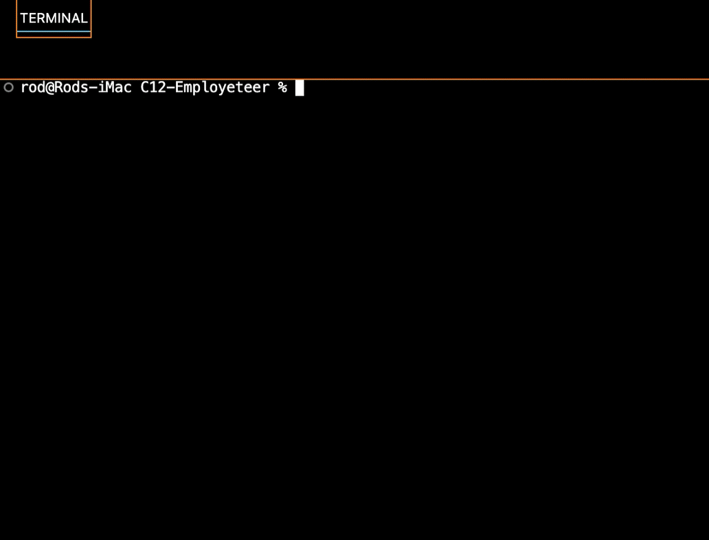
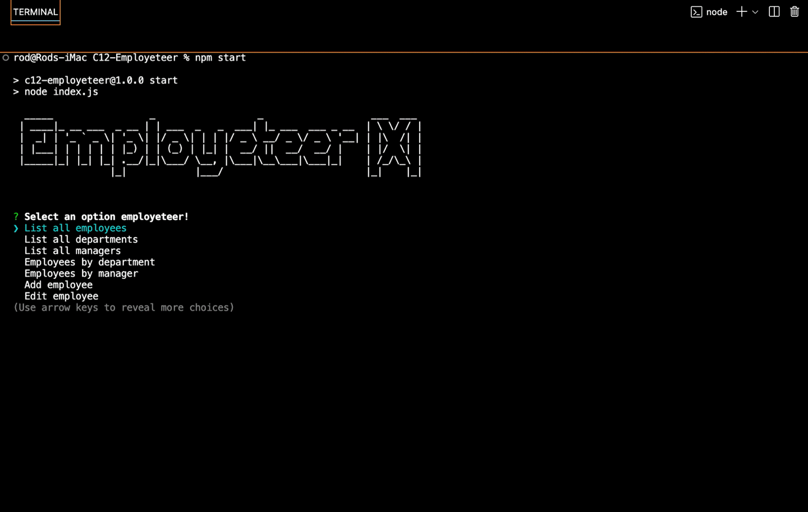

<p align="center">
  
</p>

<h1 align="center">Employeteer</h3>

<p align="center"><i>Manage your workforce databases like a puppet master.</i></p>

<p align="center">
  <a href="https://github.com/Rod-Freedom/C12-Employeteer/blob/main/LICENSE"></a>
</p>

<br>
<br>

## **ABOUT THE PROJECT**
### **Overview**
Be the masterhand of your employees databases.

Welcome to ***Employeteer***, the ultimate Node.js application designed to simplify the management of employee databases without the need for any SQL expertise. With Employeteer, you can effortlessly oversee your workforce data with an intuitive, user-friendly interface that puts you in full control.

*Find the repo [here](https://github.com/Rod-Freedom/C12-Employeteer).*

<br>
<br>

## Table of Contents
- [License](#license)
- [Resources](#resources)
- [Get Started](#get-started)
- [Usage](#usage)
- [Demos](#demos)
- [Testing](#testing)
- [Contribute](#contribute)
- [Credits](#credits)

<br>

[(Back to the Top)](#about-the-project)

## Resources
* For JavaScript
    * ES6 modules.
    * Promises.
    * Extensive object and array destructuring.
    * Polymorphism for methods.
    * Classes and constructors.
    * Extended classes.
    * `static` methods.
    * `async` and `await` executions.
    * `try` & `catch` executions.
    * Structured error handling to prevent unexpected crashes.
    * `console.table()` to display SQL tables.
* For Node.js
    * NPM packages
        * Inquirer
        * PG
        * Dotenv
        * Chalk
        * Figlet
        * Nanospinner
    * `process.env` variables.
    * `process.exit()` to end the program.
* For SQL
    * `CREATE`
    * `SELECT`
    * `UPDATE`
    * `DELETE`
    * `AS` for column and table aliases
    * `JOIN` `LEFT`, `INTO`, `RIGHT`, etc. to join even to the same table.
    * `INSERT INTO`
    * `FROM`, `ON` & `WHERE`
    * `sum()` & `count()`
    * `GROUP BY` & `ORDER BY`

<br>

[(Back to the Top)](#about-the-project)

## Get Started
*Watch our tutorial [here](https://youtu.be/KGUw7XCQuS4?feature=shared)!*

Once you have the repo on your computer after running `git clone`, open your command line. Make sure to open the Logo Smith repo folder in your terminal. Use `npm i` to install all the modules needed to run *Employeteer*.

First clone:
```bash
$ git clone https://github.com/Rod-Freedom/C12-Employeteer.git
```
Then install the modules:
```bash
$ npm i
```

<br>

> **IMPORTANT |** *You need to have PostgreSQL installed in your computer to run Employeteer!*

<br>

[(Back to the Top)](#about-the-project)

## Usage

***Employeteer*** is easy and intuitive to use. To run it, open the Employeteer folder in your terminal, then type `node index.js` or `npm start` and hit `enter`.
```bash
$ npm start
```

The first time you run Employeteer, you'll have to provide you PostgreSQL username and password.
The tables and database will be created and seeded automatically, no need to run any command in your PostgreSQL.

```bash
Welcome! You need to set your user first.
? Whats your PostgreSQL username? user
? Type your PostgreSQL password **********
? Please confirm your password **********
Wait a sec, Employeteer is doing its magic!
✔ Creating your database...
✔ Creating tables...
All set! Please rerun Employeteer!
```

<br>

After that, run `npm start` again, and you're ready to start puppeteering your databases!
```bash
$ npm start
```

<br>

The main menu is as easy as walking; select what you want to do and answer any question the Employeteer asks.

> 

<br>

You can view all employees, also by department and manager.

> 

<br>

Adding, editing, and deleting are all options at your disposal. Enjoy ***Employeteer***!

> 

<br>

[(Back to the Top)](#about-the-project)

## License
<br>
See the [license](https://github.com/Rod-Freedom/C12-Employeteer/blob/main/LICENSE) for more details.

<br>

[(Back to the Top)](#about-the-project)

## Contribute
If you have suggestions or want to help with some improvements, you can write me by [email](mailto:rod@alpacaazul.mx).

<br>

[(Back to the Top)](#about-the-project)

## Credits
All the code was created from scratch by [Rod's Freedom](https://github.com/Rod-Freedom).

<br>

[(Back to the Top)](#about-the-project)